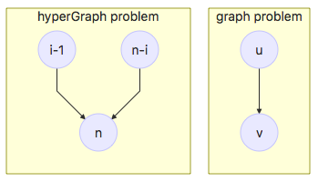
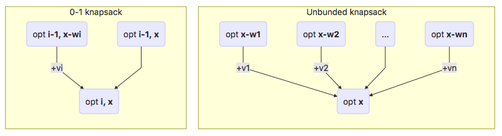

# CS519-010-Algorithms    
     
  
- [homeworks](#hw1-python-3-qsort-bst-and-qselect)  
- [sort](#sort)  
- [heap](#heap)  
- [DP and Graph](#dp-and-graph)  
- [knapsack](#knapsack)  
- [BFS and DFS](#bfs-and-dfs)  
- [graph algorithm comparison](#graph-algorithm-comparison)  
- [priority queue(PQ) implememtations for Dijkstra](#priority-queuepq-implememtations-for-dijkstra)  
  
  
### HW1: Python 3, qsort, BST, and qselect   
[code and description](./hw1)   [10/10 cases] Total Time: 0.083 s  
### HW2: Divide-n-conquer: mergesort, number of inversions, longest path   
[code and description](./hw2)  [10/10 cases] Total Time: 0.377 s  
### HW3: K closest numbers; Two Pointers   
[code and description](./hw3)  [10/10 cases] Total Time: 0.276 s  
### HW4: Priority Queue and Heaps   
[code and description](./hw4)  [10/10 cases] Total Time: 0.288 s  
### HW5: DP (part 1: simple)   
[code and description](./hw5)  [10/10 cases] Total Time: 0.009 s  
### HW6: DP (part 2)   
[code and description](./hw6)  [10/10 cases] Total Time: 0.067 s  
### HW7: Void (Midterm Week)   
### HW8: DP (part 3), Graph Algorithms (part 1)   
[code and description](./hw8)  [10/10 cases] Total Time: 0.269 s  
### HW9: Graph Algorithms (part 2), DP (part 4)    
[code and description](./hw9)  [10/10 cases] Total Time: 0.314 s
### HW10: Challenge Problem - RNA Structure Prediction (6%)    
<!--[code and description](./rna)-->  
code passed but not uploaded  [25/25 cases] Total Time: 0.582 s
  
[***Back*** to Contents ***CS 519-010***](#cs519-010-algorithms)  
  
### sort  
#### 01/11/2018 Thu  
+| qsort | qselect | bsearch |msort  
---|---|---|---|---  
1.divide | O(n) | O(n) |  O(1) |O(1)   
2.conquer | 2x | x |  x | 2x   
3.combine | O(n) | O(1) | O(1) | O(n)   
worst | O(n^2)  | O(n^2) |  O(logn) | O(nlogn)  
best | O(nlogn) | O(n)| O(logn) | O(nlogn)  
ave | O(nlogn) | O(n) | O(logn) | O(nlogn)  
  
list in `python` is more like vector in `C++`, the combination `list+list` costs O(n)  
  
[***Back*** to Contents ***CS 519-010***](#cs519-010-algorithms)  
  
### heap  
#### 01/25/2018 Thu  
+| sorted array | unsorted array | (binary) heap | sorted linked list | unsorted linked list | reverse- sorted array  
---|---|---|---|---|---|---  
insert | O(n) | O(1) | O(logn) |  O(n) |O(1) | O(n)  
pop-min | O(n) | O(n) | O(logn) |  O(1)|O(n) | O(1)  
peak | O(1) | O(n) | O(1) | O(1) | O(n) | O(1)  
decrease-key | O(n) | O(n) | O(logn) |  
heapify |O(nlogn)|O(1)|O(n)|O(nlogn)|O(1)|O(nlogn)  
  
[***Back*** to Contents ***CS 519-010***](#cs519-010-algorithms)  
  
  
### DP and graph  
#### 02/08/2018 Thu
+| optimization | summary  
---|---|---  
graph | MIS  max,min maxmin Unbunded | (sum, expectation) Fib bitstrings   
hyperGraph | matrix-chain | # of BSTs  
  
- Number of n-node BSTs problem is a hyperpraph problem  
  
  
  
[***Back*** to Contents ***CS 519-010***](#cs519-010-algorithms)   
  
### knapsack  
#### 02/13/2018 Tue  
knapsack problem(W, vi,wi,[ci]):  
- 0-1 knapsack  
- Unbunded knapsack  
- Bouded knapsack  
  
All the weights are intergers  
  
##### 1. Unbunded knapsack  
- approach:  
1. Subproblem    
    opt[x]: the subsolution for a bag of x  
1.  Recurrence    
    opt[x]=max{ **opt[x-w[i]]+v[i]** }, i=0..n-1 and x>=w[i]  
1. base case  
    opt[0] = 0  
- Unbunded is a graph problem  
    - time  = E(edges) = O(nW)  
    - space = V(node) = O(W)  
- topological order in graph  
- recursive method(top-down) can automaticly avoid useless value x's without gcd  
  
##### 2. 0-1 knapsack  
- approach:  
1. Subproblem    
    opt[i][x]: opt value for a bag of x, **using** items **0~i**  
1.  Recurrence    
    opt[i][x]=max{ **opt[i-1][x-w[i]]+v[i], opt[i-1][x]** }, i=0~n-1 and x>=w[i]    
    max { choose i, not choose i }  
1. base case  
    - opt[i][0] = 0, i=0~n-1  
    - opt[-1][x] = 0, x=0~W    
- Bounded is a graph problem    
    - time  = E(edges) = O(nW)    
    - space = V(node) = O(nW)  
- 2 nested for loops(i,x), no matter the order of i/x  
- in top-down method, order doesn't matter  
  
  
  
[***Back*** to Contents ***CS 519-010***](#cs519-010-algorithms)  
  
  
### BFS and DFS  
#### 03/01/2018 Thu  
+| BFS | DFS  
---|---|---  
structure| queue | stack  
topological order| bottom-up| top-down  
start from| source| sink  
  
[***Back*** to Contents ***CS 519-010***](#cs519-010-algorithms)  
  
  
### graph algorithm comparison  
#### 03/01/2018 Thu  
+| Viterbi | Dijkstra
---|---|---|
restriction| DAG (**BIG restriction**) | non-gegative weights
advantage| fast | works in undirected graph works in acyclic/cylic gragh could have early termination
usage| longest/shortest/ number/minmax | shortest path  single source (***s*** to any)|
implementation| topological sort+ BFS(**queue**) | best-first (**priority** queue)  with **decrease key**
time complexity |  | logV-orange.svg)  
common| coin problem, TSP | coin problem, TSP   
  
[***Back*** to Contents ***CS 519-010***](#cs519-010-algorithms)  
  
  
### priority queue(PQ) implememtations for Dijkstra  
#### 03/06/2018 Tue  
  
- make your window of browser  as you can

+| PQ (heapdict)| PQ (hash) | PQ (heap) |PQ (unsorted list)
---|---|---|---|---
implementation| binary heap (heapdict)|hash | binary heap| unsorted list
operatrions|pop-min: logV push: logV   decrease-key: logV | pop-min: V  push: O(1)   decrease-key: O(1) | pop-min: logE push: logE   decrease-key: logE (push new) | pop-min: V  push: O(1)   decrease-key: V
time complexity |logV-orange.svg)  ↘|  ↓ | logE-orange.svg)  ↘ |  ↓
while PQ not empty:  1. u = pop()  2. for each u->v in E: 2.1 decrease-key|V -----------→ **VlogV** logV --------↗ **+** e---→ elogV → **ElogV** logV↗|V ---→ **V^2** V ---↗ **+** e→ e → **E** 1 ↗ | E -----------→ **ElogE** logE --------↗ **+** e---→ elogV → **ElogE** logE↗ | V ---→ **V^2** V ---↗ **+** e→eV→**EV** V ↗ 
usage|sparse map E~V|dense map E~ ϴ(V^2)
dense E~ ϴ(V^2)|V^2logV|V^2 (★)| V^2logV | V^3
sparse E~V|VlogV (★)|V^2 | VlogV |V^2
sparse E~VlogV|Vlog^2(V) (★)|V^2
test time on `flip`| 0.769 s (DIY version)| - | 0.314 s|-

  
[***Back*** to Contents ***CS 519-010***](#cs519-010-algorithms)  

### RNA problem
#### k-best
  
- I implemented several versions for q3:k-best:  
    +|alg2_1 log n |alg2_2 log k|alg3 pure lazy
    :--:|--|--|--
    implementaion|unlazy generate+lazy get baby dijkstra, **one heap**|alg2_1+**qselect** cut & maitain heap size of k|lazy generate **dict{(i,j):heap**}
    time complexity|O(2n^3 + 2n^2klog(2n))|O(n^3 + 3mn^2 + 2n^2klog(2m))  -- m=min(k, n)|O(n^3 + nklogn)
    k < 0.4n| O(2n^3 + 2n^2klog(2n)) | O(n^3 + 3kn^2 + 2n^2klog(2k)) (☆)|(★)
    0.4n < k < n| O(2n^3 + 2n^2klog(2n) (☆)| O(n^3 + 3kn^2 + 2n^2klog(2k))|(★)
    k > n| O(2n^3 + 2n^2klog(2n) (☆)| O(4n^3 + 2n^2klog(2n))|(★)

- table of running time for k-best  
    length|k-best|alg2_1 logn|alg2_2 logk|alg3 pure lazy |benchmark
    ---:|---:|---:|---:|---:|---:  
    40 |10   | 0.023 s| 0.042 s |0.010 s |0.036 s
    40 |100  | 0.129 s| 0.105 s |0.023 s |0.206  s
    40 |1000 | 1.002 s| 1.038 s |0.101 s |1.646 s
    111|10   | 0.275 s| 0.364 s |0.193 s |0.466 s
    111|100  | 1.354 s| 1.387 s |0.203 s |2.348 s
    111|1000 |11.355 s|11.125 s |0.591 s |19.298 s
    210|10   | 1.402 s| 1.769 s |1.186 s |2.163 s
    210|100  | 6.022 s| 5.912 s |1.297 s |8.804 s
    210|1000 |46.544 s|48.438 s |2.634 s |81.134 s
[***Back*** to Contents ***CS 519-010***](#cs519-010-algorithms)  